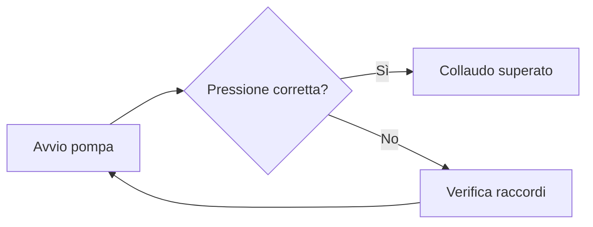

# Collaudo

Il collaudo segue il flusso seguente.

```mermaid
flowchart LR
  A[Avvio pompa] --> B{Pressione corretta?}
  B -- Sì --> C[Collaudo superato]
  B -- No --> D[Verifica raccordi]
  D --> A
```

Registra l'esito nel modulo allegato al verbale.
